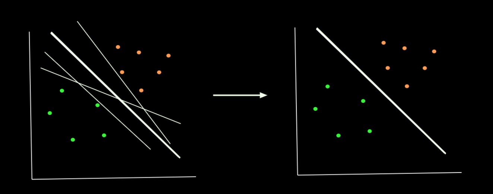
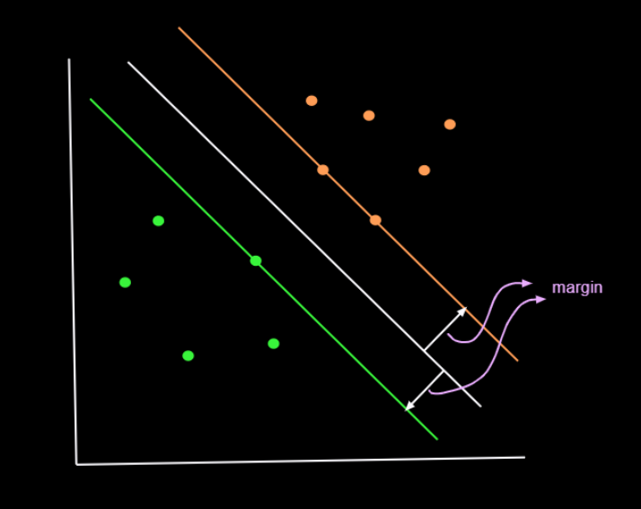

Unlike logistic regression, which tries to find a plane(can be more than one plane that fits the purpose) that separates two set of points in an n-dimensional space, svm tries to find a plane that separates as good as possible.

Let's take two set of points that are fully separated with the possible planes that that can separate those two set of points. All the planes (lines) can separate those two set of points. But the thicker plane(line) seems to be the better choice, as it is exactly at the center of the two clusters ( set of points ).

For that we will consider two planes that are parallel to the required plane, one on each side so that the required plane will be exactly at the center of those two planes. The green one passes through through one green point and the other one(orange plane) passes through two orange points.  These two planes are in such a way these acts as a decision boundary for that particular class.

- All the points on and below the green plane are considered as green class.
- And all the points on and above the orange plane are considered as orange class.

So, we will try to find the plane (white one) such that the space between the **nearest green and orange point** is  as large as possible. This space, we call it as **margin**. Thus svm is called as **margin maximization problem**. And we have to infer that the plane has to be exactly at the same distance from nearest points from both classes. Otherwise that won't be a perfect plane. Think about it once.

<!-- importing info banner from the components -->
import InfoBanner from '~/components/markdown/InfoBanner.vue'

<InfoBanner>
  

  In this case we assume that there are no misclassified points. Later, we allow the model to make few mistakes to avoid overfitting. We will see that later. For now, we are considering the ideal case.
  

</InfoBanner>

>  In this case we assume that there are no misclassified points. Later, we allow the model to make few mistakes to avoid overfitting. We will see that later. For now, we are considering the ideal case.

**Why bigger margin is better ?**

- If we choose a well separating hyperplane, that is close to one class, there is a high chance of misclassification even for very little noise in the test or validation data.
- And intuitively it makes sense.

Before making the optimization function, we need to have a clear idea on equation of a plane, distance from point to plane, and distance between two parallel planes(margin). Here are the resources from which you can understand it better.

### Pre-requisites

- [Position-vector, line-vector, free-vector and unit-vector](https://www.youtube.com/watch?v=w_Bl6xbvl3g)
- [Linear transformations and matrices | Essence of linear algebra, chapter 3](https://www.youtube.com/watch?v=kYB8IZa5AuE)
- [Dot products and duality | Essence of linear algebra, chapter 9](https://www.youtube.com/watch?v=LyGKycYT2v0)
- [Equation of a plane (3D) from brilliant.org](https://brilliant.org/wiki/3d-coordinate-geometry-equation-of-a-plane/) - Same can be applied for 2D. Here, we call that a line. We can also have lines in 3D. But the surface that separates a space into two parts is called line in 2D, plane in 3D, and hyperplane in n-dimensional space.
- Distance from point to plane
  - [https://mathinsight.org/distance_point_plane](https://mathinsight.org/distance_point_plane)
  - https://mathworld.wolfram.com/Point-PlaneDistance.html

### Optimization Function

In binary classification problem, we usually have +ve and -ve class points. Here we take orange class as +ve and green as -ve. Unlike logistic regression, we assume the corresponding labels are {-1, 1} instead of 0/1 for -ve and +ve class respectively.

There are so many ways to forming the optimization problem. Here, we will look at the simplest thing possible. While giving the intuition about svm, I told you that that there are two planes which are equidistant from the required plane. Now, forget that those are planes. Instead, think of them like a regions from the decision surface (white plane) on both sides, in which there are no points. All the points, on both sides, lies on and above( or below). So, we need to find a plane that separates two set of points and is equidistant from the nearest points of both the classes. And margin can defined as the distance from the separating plane to the nearest point on both sides.

Let's say that the plane equation is $w^Tx+b=0$.  where, $w$ is a weight vector that represent the plane which is normal to the plane and $x$ represents any point on the plane that satisfies the equation (obviously) and $b$ is the bias. Intuitively $w$ decides the orientation of the plane and  $b$ decides how far the plane is from the origin. Some say that $b$ is the distance from origin to the plane, It is true if you ignore the sign of the distance. Take a look at [this graph](https://technology.cpm.org/general/3dgraph/?graph3ddata=____anxQOx1YxBEdH1cpzbIzU8ywedH1cqtH2syiuRQdH1c) to get the better intuition. Feel free to create such planes in a new chart. 

The hypothesis is that   $\displaystyle w^{T} x_{i} +b >0$ for all +ve points and $\displaystyle w^{T} x_{i} +b<0$ for all -ve points. Here, we want to find a plane that. it is at a equal distance from both nearest negative and nearest positive point(s). Say, $x_n$ is my nearest point. It can be any one of those 3 points(2 orange and 1 green). From any of these points, margin will be same. 

Now, If we scale w and b by some constant( k\*w and k\*b), Does the plane change ? No. The plane remains same. That means we have infinite representations of the same plane.  Without the loss of generality, we are assuming that $\displaystyle \ |w^{T}x_{n}+b\ |=1$ for the nearest point(s). It's -1 for the nearest negative class point and +1 for the nearest positive class point to be precise. Instead of taking modulus, we can rewrite the same thing as $\displaystyle \ y_n(w^{T}x_{n}+b)=1$ where $y_n$is the corresponding y label (-1 or +1). It is just the matter of scaling. We are not just assuming things and throwing it away. We will stick to it and try to solve this problem along with this constraint. Let's find the margin.

The distance from $x_n$ (nearest point) to the plane would be $\displaystyle \frac{|w^{T} x_n+b|}{\|w\|}$. We already assumed (constrained) that $\displaystyle |w^Tx_n+b|=1$ for all the nearest points. So, our final margin would be $\displaystyle \frac{1}{\|w\|}$. And the constraint, we will generalize it for all the points. It is exactly $1$ for the nearest points, and $>1$ for other points (which is obvious). we call these as interior points. So we can write this constraint as $y_i(w^Tx_i+b) \geqslant 1$.

$$
\begin{aligned}
\text{maxi}&\text{mize} \enspace \frac{1}{\| w\| } \\
           &\text{subject to} \kern+0.4em y_{i}\left( w^{T} x_{i} +b\right) \geqslant 1\ \text{for} \ x_{i} \epsilon \Chi \ 
\end{aligned}
$$
Same thing can also be written as follows.
$$
\begin{equation}
\begin{array}{ l l }
\text{minimize} \kern+0.4em \frac{1}{2} w^{T} w & \\
\kern+0.4em \text{subject to} \kern+0.4em y_{i}\left( w^{T} x_{i} +b\right) \geqslant 1\ \text{for} \ x_{i} \epsilon \Chi  & \ 
\end{array}
\end{equation*}
$$

This is constrained optimization problem. This is called as **Primal formulation** of SVM. We can't solve this directly as we have few constraints. Here, we can use **LaGrange** to solve it. Essentially, what we will do here is to make the constraint as part of the optimization problem and solve it the usual way. First a quick recap about Lagrange.

